# The Build — Starter

**CIK3101 · Web Application Development · Sains Data · Semester 3 · Universitas Cakrawala**

Repo ini adalah tempat kerja kelompokmu selama 16 sesi. Artefak tiap sesi dikerjakan **di dalam
sesi** dan di-commit sebelum kelas selesai. **Tidak ada pekerjaan rumah.**

Repo ini sengaja **belum berisi aplikasi**. `frontend/` dan `backend/` kosong — kamu yang
mengisinya, mulai malam ini di Sesi 2. Yang sudah disediakan hanyalah rel: dokumen, CI, dan
pemeriksa nilai.

> **Proyek akhir mata kuliah ini bernama The Build, bobot 20% (Tugas Kelompok).**
> The Build bukan tugas tambahan. The Build adalah gabungan artefak Sesi 2–14 di repo ini,
> didemokan di Sesi 15 dan diverifikasi di Sesi 16. Baca **[`docs/PROJECT.md`](docs/PROJECT.md)**
> — itu piagam proyekmu, dan diisi malam ini.

---

## 0. Membuat repo kelompok (sekali saja, di Sesi 2)

Ini **administratif**, bukan tugas — sama seperti membawa laptop. Dikerjakan **ketua kelompok**,
sekali, di awal lab.

```bash
# 1. Di GitHub: buka repo template ini, klik "Use this template" -> "Create a new repository"
#    Nama repo : wad-2026-kNN     (NN = nomor kelompokmu, contoh wad-2026-k04)
#    Visibility: PUBLIC           (wajib — branch protection tidak tersedia di repo privat gratis)

# 2. Tambahkan 3 anggota lain sebagai collaborator
#    Settings -> Collaborators -> Add people   (pakai username GitHub mereka)

# 3. Semua anggota clone repo KELOMPOK, bukan template-nya
git clone https://github.com/<username-ketua>/wad-2026-kNN
cd wad-2026-kNN
cp .env.example .env
```

**4. Lindungi `main`** — ini butir 1 rubrik malam ini, dan dilakukan ketua:

> Settings → Branches → **Add branch protection rule**
> - Branch name pattern: `main`
> - ☑ **Require a pull request before merging**
> - ☑ **Do not allow bypassing the above settings**
> - Save changes

Setelah itu `git push` langsung ke `main` akan ditolak. Itu memang tujuannya. Semua perubahan
lewat branch `feature/*` dan pull request.

> "Require approvals" **jangan** dinyalakan malam ini — undangan collaborator mungkin belum
> diterima semua anggota, dan kamu akan terkunci tidak bisa merge. Naikkan ke 1 approval di
> Sesi 3, setelah semua anggota masuk.

**5. Kirim URL repo kelompokmu ke thread RISE.** Tanpa itu dosen tidak tahu ke mana harus menilai.

---

## 1. Prasyarat

| Alat | Versi | Cek |
|---|---|---|
| Git | apa saja | `git --version` |
| Node.js | 20 LTS atau lebih baru | `node -v` |
| Python | 3.11 atau lebih baru | `python --version` |
| Akun GitHub | — | sudah jadi anggota repo ini |

> Windows: saat install Python dari python.org, **centang "Add Python to PATH"**.
> Kalau `python` tidak dikenali, coba `py`.

Tidak ada yang perlu di-install untuk basis data sampai Sesi 5. Sampai sesi itu repo memakai
SQLite, yang sudah menyatu dengan Python.

## 2. Layanan

| Layanan | Port lokal | Mulai dipakai | Catatan |
|---|---|---|---|
| Frontend (Vite + Vue 3) | `5173` | Sesi 2 | kamu yang membuat isi `frontend/` |
| Backend (FastAPI + Uvicorn) | `8000` | Sesi 2 | kamu yang membuat isi `backend/` |
| Basis data | — | Sesi 3 | SQLite lokal; ganti ke Postgres (Neon) di Sesi 5 lewat `DATABASE_URL` |

## 3. Cara menjalankan

```bash
# sekali saja, setelah clone
cp .env.example .env

# --- backend (terminal 1) ---
cd backend
python -m venv venv
# macOS/Linux:
source venv/bin/activate
# Windows:
# venv\Scripts\activate
pip install -r requirements.txt
uvicorn app.main:app --reload

# --- frontend (terminal 2) ---
cd frontend
npm install
npm run dev
```

Dua server itu yang dipakai aplikasi UTS ini: backend FastAPI di `:8000`, frontend Vue 3 di
`:5173`. Nyalakan backend dulu, baru frontend — `frontend/` mengambil data dari
`http://localhost:8000/sessions`, dan CORS hanya mengizinkan origin `http://localhost:5173`.
Swagger UI-nya ada di `http://localhost:8000/docs`.

## 4. Cara memverifikasi

Satu perintah, dipakai sepanjang semester:

```bash
python verify.py --sesi 2
```

`verify.py` adalah **perintah yang sama persis** yang dipakai dosen untuk memeriksa artefakmu.
Kalau hijau di laptopmu, hijau juga saat dinilai. Jalankan sebelum kamu keluar dari sesi.

> **CI merah saat repo baru itu normal.** Pemeriksa berjalan juga di GitHub Actions, dan pada
> repo kosong ia memang gagal — belum ada `frontend/` dan `backend/`. **Membuatnya hijau adalah
> tugasmu malam ini.** Ketentuan 7 (CI merah = 0 fungsionalitas) dinilai pada akhir sesi, bukan
> pada commit pertama.

Verifikasi manual yang juga dinilai:

- `http://localhost:5173` — halaman kerangka muncul, masih rapi di lebar 360px
- `http://localhost:8000/health` — balas `200` dengan `{"status":"ok"}`
- `http://localhost:8000/docs` — OpenAPI terbuka

### Requirement UTS

Dijalankan dengan backend hidup di `:8000`, lewat **Swagger UI di
`http://localhost:8000/docs`** (bukan curl):

1. **GET /sessions** — klik **Try it out**, isi `search=budi`, `skip=0`, `limit=5`
   → **Execute** → respons `200` berisi hasil pencarian pada field `route`/`driver`.
2. **GET /sessions/{session_id}** — isi `session_id=9999` → **Execute** → `404`
   `{"detail":"Session not found"}`.
3. **POST /sessions** — **Try it out**, isi body valid (`route`, `driver`, `capacity`,
   `departure_time`) → **Execute** → `201 Created` + `id` baru.
4. **POST /sessions** — ulangi dengan body yang melanggar aturan (mis. `capacity:-1`
   atau `route` kurang dari 3 karakter) → **Execute** → `422` + detail validasi Pydantic.
5. **DELETE /sessions/{session_id}** — id yang ada (mis. `1`) → `204 No Content` tanpa
   badan; id yang tidak ada (`9999`) → `404`.
6. **CORS** — tidak bisa diuji dari Swagger. Buka `http://localhost:5173`, DevTools →
   tab **Network** → request `/sessions` → lihat header respons
   `access-control-allow-origin: http://localhost:5173`.

> Dataset bersifat **in-memory**: POST/DELETE hilang saat backend berhenti. Restart
> `uvicorn` dulu sebelum mulai testing supaya data awal (13 baris) konsisten.

Di frontend `http://localhost:5173`, empat keadaan ini dicek satu per satu:

- **Loading** — teks "Memuat data shuttle session…" tampil selama data diambil.
- **Error** — matikan backend lalu muat ulang halaman; muncul pesan error dan tombol **Retry**
  yang mengambil data ulang setelah backend hidup lagi.
- **Empty** — cari kata yang tidak ada (misal `zzzz`), muncul pesan pencarian tidak ditemukan.
- **Success** — tabel terisi, pencarian menyaring `route`/`driver`, tombol **Prev/Next**
  (ikon panah `ChevronLeft`/`ChevronRight`) menggeser `skip`/`limit` (Prev mati di halaman
  pertama, Next mati di halaman terakhir), dan tiap baris punya tombol **Hapus** (ikon
  `Trash2`) dengan konfirmasi browser `confirm()`. Badge status berwarna per makna:
  `Available` hijau, `Booked` biru, `Full` merah, `Maintenance` kuning.

### Checklist requirement UTS

Bukti screenshot tersimpan di `docs/screenshots/` dan direferensikan langsung dari tabel
di bawah ini.

| # | Requirement | Cara verifikasi | ✓ | Bukti |
|---|---|---|---|---|
| 1 | Dataset in-memory ≥ 12 baris | Buka `backend/app/data.py` (13 baris) | ✓ | [`backend/app/data.py`](backend/app/data.py) |
| 2 | GET `/sessions` — pagination + search | `/docs` → GET `/sessions` → Try it out → `search=budi`, `skip=0`, `limit=5` → Execute | ✓ | 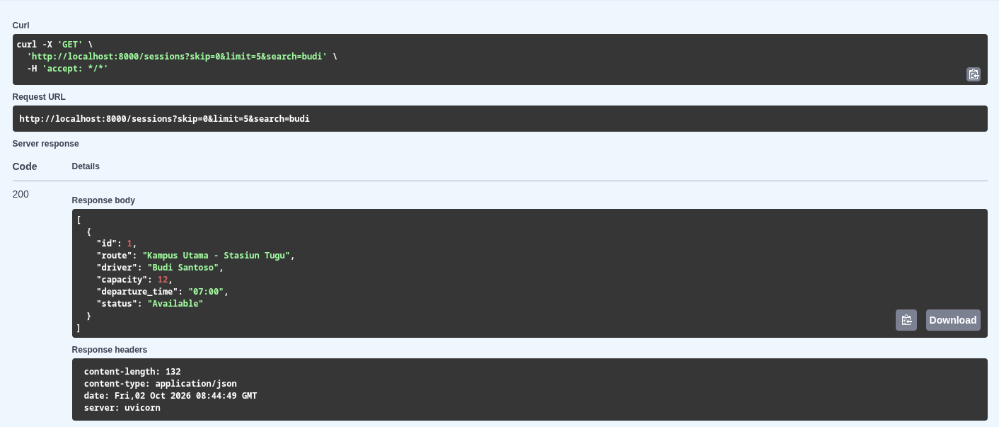 |
| 3 | GET `/sessions/{id}` — 404 | `/docs` → GET `/sessions/{session_id}` → id `9999` → Execute | ✓ | 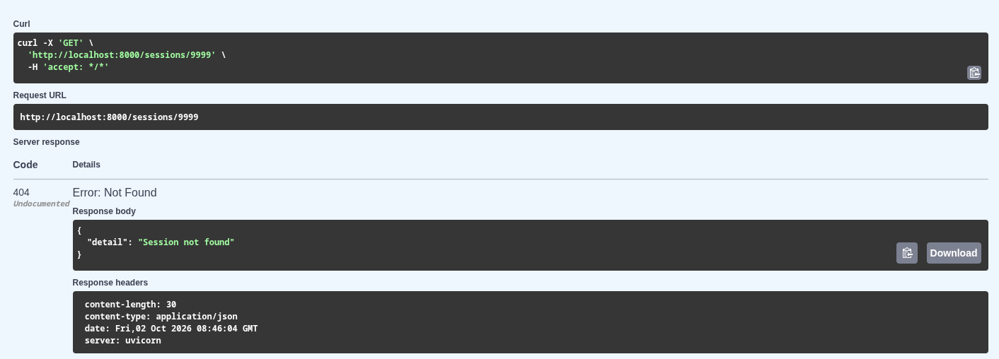 |
| 4 | POST `/sessions` — Pydantic 201 | `/docs` → POST `/sessions` → body valid → Execute → `201` + id baru | ✓ | 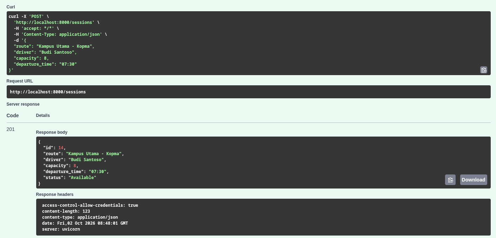 |
| 5 | POST `/sessions` — validasi 422 | `/docs` → POST `/sessions` → body invalid (`capacity:-1`) → Execute → `422` | ✓ | 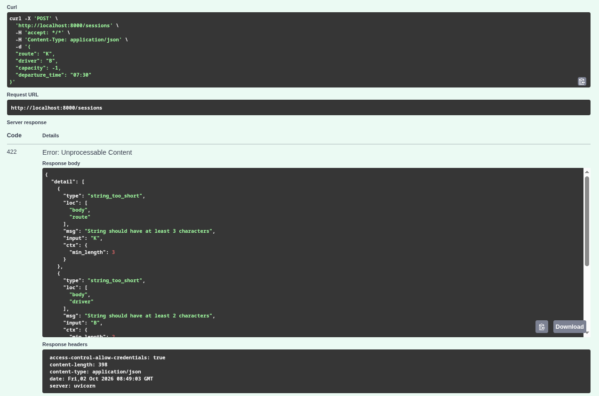 |
| 6 | DELETE `/sessions/{id}` — 204 | `/docs` → DELETE `/sessions/{session_id}` → id `1` → Execute → `204` tanpa badan | ✓ | 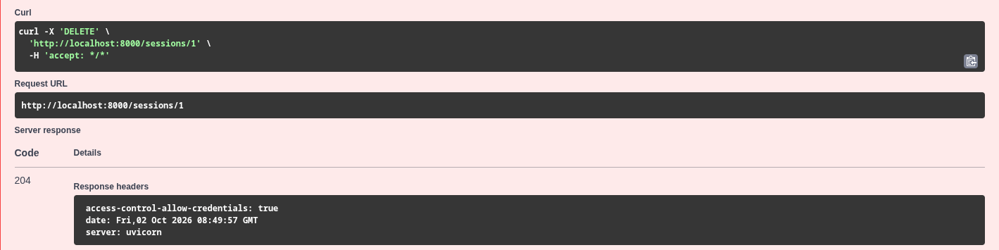 |
| 7 | DELETE id tak ada — 404 | `/docs` → DELETE → id `9999` → Execute → `404` | ✓ | 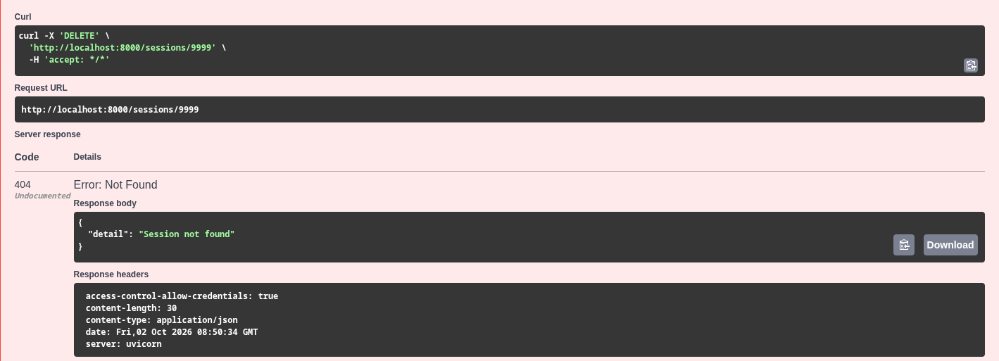 |
| 8 | CORS origin frontend | `:5173` → DevTools Network → request `/sessions` → header `access-control-allow-origin` | ✓ | 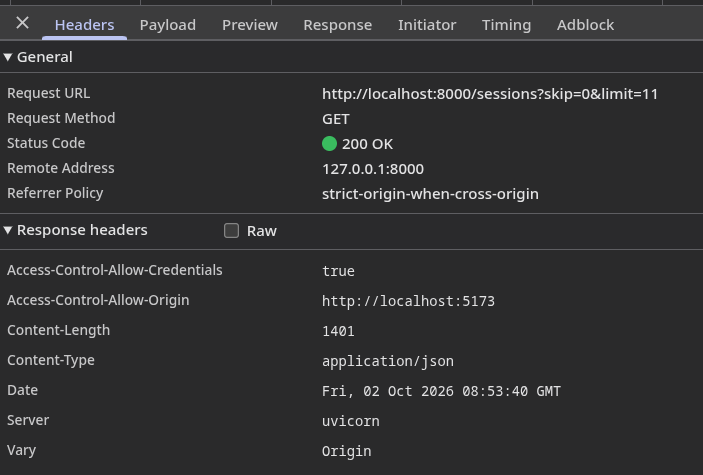 |
| 9 | Frontend daftar dari API | Buka `http://localhost:5173`, tabel terisi | ✓ | 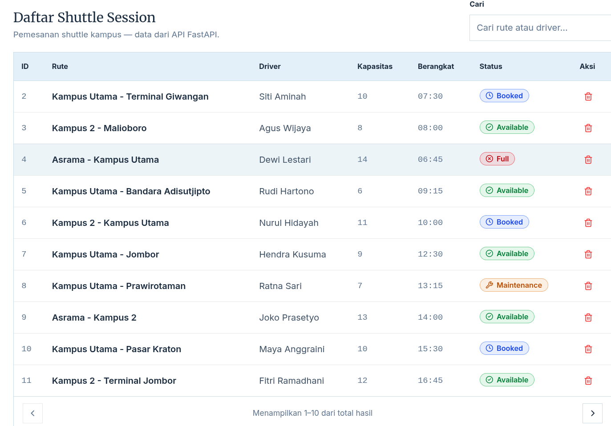 |
| 10 | State **Loading** | Muat ulang halaman, teks "Memuat data shuttle session…" tampil | ✓ | 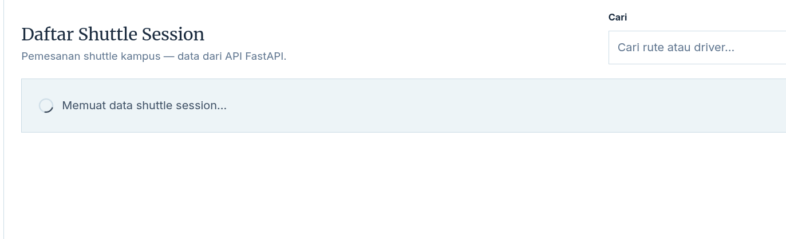 |
| 11 | State **Error** + Retry | Matikan backend → reload → pesan error + tombol Retry; nyalakan backend → Retry sukses | ✓ | 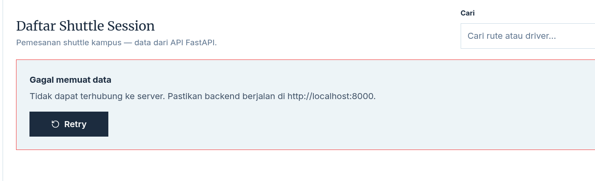 |
| 12 | State **Empty** | Cari `zzzz` → pesan pencarian tidak ditemukan | ✓ | 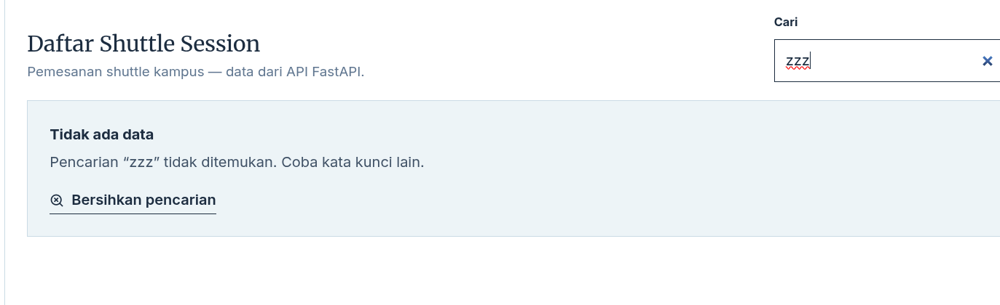 |
| 13 | State **Success** + pagination | Tabel terisi; Prev/Next menggeser halaman, status disabled tepat | ✓ | 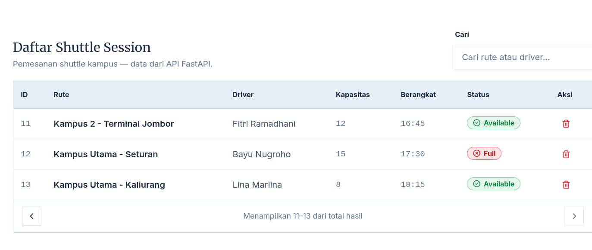 |
| 14 | Form create + validasi | Submit kosong → error per field; isi valid → baris baru muncul (201) | ✓ | 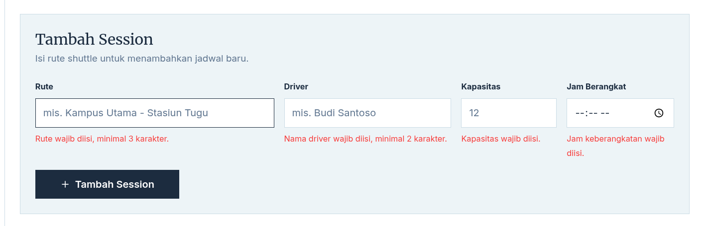 · 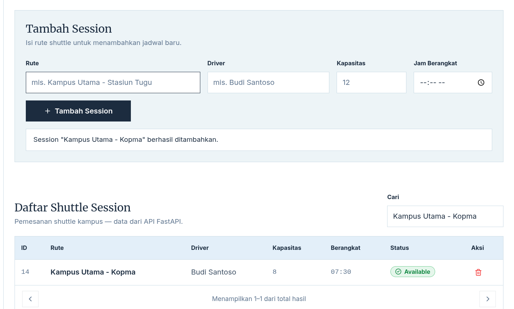 |
| 15 | Hapus dengan konfirmasi | Klik ikon hapus → dialog `confirm()` → OK → baris hilang (204) | ✓ | 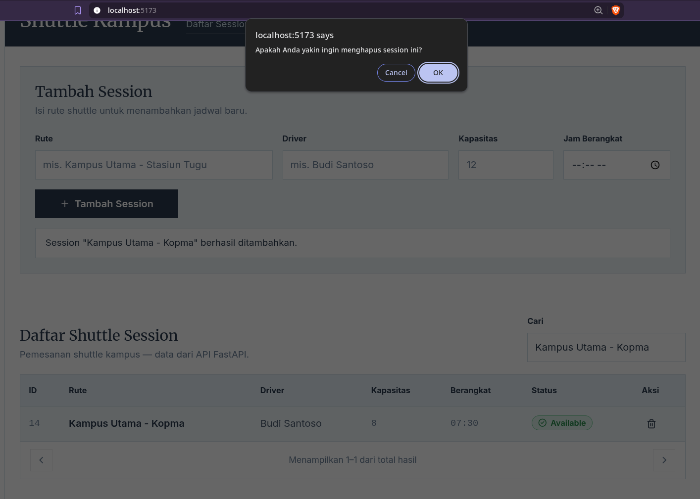 |
| 16 | Backend `/health` + `/docs` | Buka `http://localhost:8000/health` → `{"status":"ok"}`; buka `http://localhost:8000/docs` | ✓ | 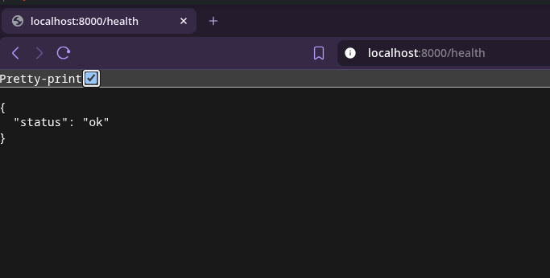 · 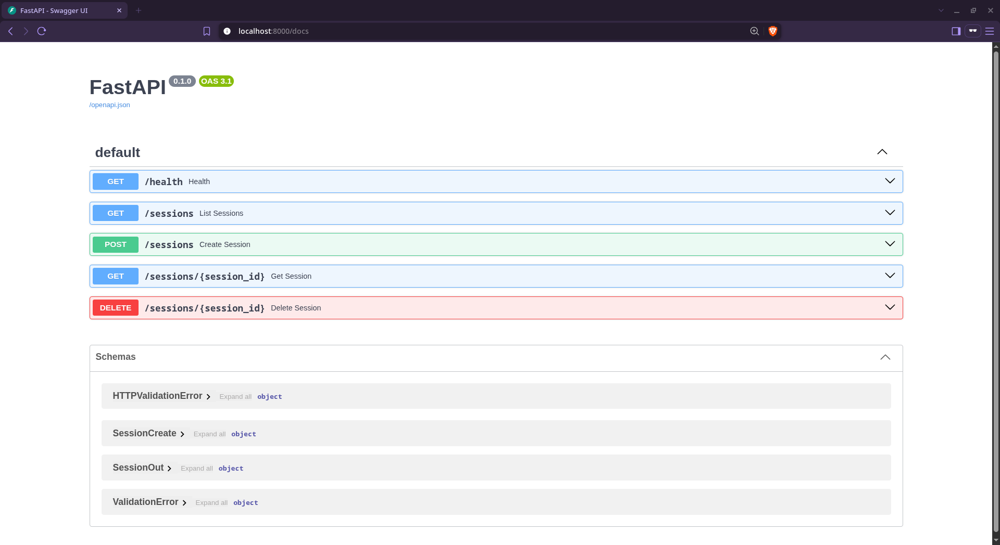 |
| 17 | `python verify.py --sesi 2` hijau | Semua pemeriksaan OK | ✓ | 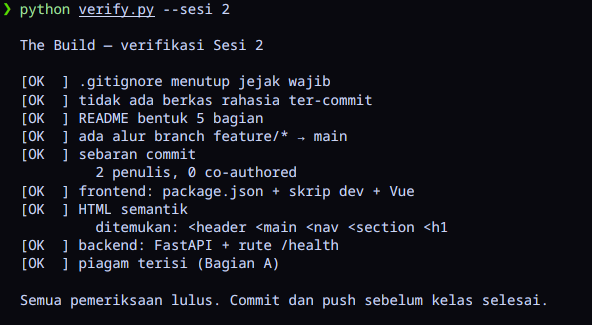 |

## 5. Masalah yang sering muncul

| Gejala | Sebab biasanya | Tindakan |
|---|---|---|
| `python` tidak dikenali (Windows) | PATH tidak dicentang saat install | pakai `py`, atau install ulang dan centang "Add Python to PATH" |
| `npm run dev` jalan tapi halaman kosong | `index.html` tidak menunjuk `src/main.js` | cek `<script type="module" src="/src/main.js">` |
| `/health` 404 | `app.main` bukan modul yang dijalankan | jalankan `uvicorn` dari dalam folder `backend/` |
| CI merah karena `secret-scan` | ada rahasia ter-commit | **hapus nilainya, rotasi, commit ulang** — lihat Ketentuan 8 di bawah |
| `venv/` ikut ter-commit | `.gitignore` diubah | kembalikan `.gitignore` bawaan repo |
| Menu **Branches → Add rule** tidak ada | repo dibuat **Private** | Settings → General → Danger Zone → **Change visibility → Public** |
| Tidak bisa merge PR sendiri | "Require approvals" sudah dinyalakan | matikan dulu malam ini (lihat bagian 0 langkah 4) |

---

## Berkas siapa

| Punya kamu — kerjakan | Punya dosen — jangan diubah |
|---|---|
| `frontend/` (seluruhnya) | `verify.py` |
| `backend/` (seluruhnya) | `.github/workflows/` |
| `docs/PROJECT.md` (isian piagam) | `Dockerfile` |
| `docs/api-contract.md`, `docs/state.md` | `.gitignore`, `.env.example` |
| `CONTRIBUTORS.md` (isian nama) | `docs/DEPLOY.md` |
| `README.md` bagian 1–5 di atas | bagian **Ketentuan** di bawah |

Mengubah berkas milik dosen agar `verify.py` jadi hijau dihitung sebagai artefak yang tidak dapat
dipertahankan — nilainya 0 (Ketentuan 5).

## Peta sesi

| Sesi | Bobot | Yang jadi di ruang kelas |
|---|---|---|
| 1 | 2% | Jejak permintaan beranotasi |
| **2** | **2%** | **Repo + kerangka frontend/backend + README + 1 PR + piagam `docs/PROJECT.md`** |
| 3 | 2% | Endpoint pertama berjalan (FastAPI, Pydantic, status code) |
| 4 | **5%** | Diagram lapisan MVC + refactor satu endpoint |
| 5 | 2% | CRUD persisten + migrasi Alembic diterapkan · **pindah ke Postgres** |
| 6 | 2% | Rute + controller tipis + penanganan error terpusat |
| 7 | **5%** | `docs/api-contract.md` + model data (peer review) |
| **8** | **25%** | **UTS — ujian praktik individual** |
| 9 | 2% | Alur login berfungsi (JWT + bcrypt) |
| 10 | 2% | Otorisasi tingkat objek + RBAC |
| 11 | **5%** | Kerentanan ditemukan dan ditutup (break-in round) |
| 12 | 2% | Frontend terhubung + dua grafik + `docs/state.md` |
| 13 | 2% | Lima pengujian berjalan + tabel pengukuran di README |
| 14 | **5%** | **URL publik aktif + CI hijau** |
| 15 | 2% | **Demo The Build 8 menit di URL publik + pembelaan** |
| **16** | **25%** | **UAS — verifikasi submission + pembelaan tertulis** |

Urutan ini mengikuti RPS, bukan nomor berkas catatan mingguan.

## Ketentuan yang paling sering menghapus nilai

1. **Artefak wajib dapat dipertahankan.** Kode yang tidak bisa kamu jelaskan bernilai **0**,
   sebagus apa pun hasilnya. Berlaku juga untuk bagian yang ditulis anggota lain. Riwayat commit
   adalah bukti utama kepemilikan.
2. **Tidak dapat dijalankan = 0 fungsionalitas.** Gagal run, gagal build, atau CI merah bernilai
   0 pada komponen fungsionalitas. Aplikasi dinilai dengan **dijalankan di hadapan dosen**, bukan
   dari tangkapan layar.
3. **Tanpa commit atas namamu sendiri = 0 Tugas Kelompok**, berapa pun nilai timmu. Nilai
   individu = nilai kelompok × faktor kontribusi (0–1) dari commit/PR sendiri, peer assessment,
   dan kemampuan menjelaskan bagian **mana pun** dari kode.
4. **Kredensial ter-commit membatalkan nilai artefak sesi itu** — kunci API, kata sandi basis
   data, token. Berlaku **sejak Sesi 2**, jauh sebelum keamanan diajarkan formal. Karena itu
   `.env` ada di `.gitignore` dan CI menjalankan pemindai rahasia.
5. **Commit sebelum keluar.** Semua tenggat adalah akhir sesi. Waktu commit adalah bukti kerjamu
   dilakukan di dalam sesi.

## Penggunaan AI assistant

AI assistant **diizinkan** pada sesi praktikum, dan **dilarang pada UTS (Sesi 8) dan UAS
(Sesi 16)**. Syaratnya satu: tulis pengungkapan singkat di bawah ini, dan perbarui saat berubah.
Ketentuan 1 tetap berlaku penuh — kalau kamu tidak bisa menjelaskan kode yang dihasilkan AI,
nilainya 0.

<!-- ISI BAGIAN INI. Contoh:
- Sesi 2 — Claude, untuk menjelaskan pesan error `npm ERR! ENOENT`. Kode ditulis sendiri.
- Sesi 5 — GitHub Copilot, autocomplete pada model SQLAlchemy. Ditinjau dan diubah manual.
-->

- UTS individual, dikerjakan sebelum Sesi 8 — `opencode` (AI coding agent, model
  `opencode/mimo-v2.6-flash-free`) membantu menyusun `backend/app/` (data in-memory, skema
  Pydantic, lima endpoint + CORS), komponen `frontend/src/` (daftar 4 keadaan, form tambah,
  hapus dengan konfirmasi), dan draf dokumentasi ini. Semua perubahan saya tinjau sebelum
  di-commit, dan verifikasinya saya jalankan sendiri: `npm run build`, `python verify.py`,
  uji tiap endpoint lewat Swagger (`/docs`), serta pengujian browser untuk empat keadaan UI,
  validasi form, dan alur hapus. Saya bisa menjelaskan setiap baris yang ada di repo ini.

## Kalau kamu tersendat

Tersendat di satu sesi tidak menghapus nilai sesi lain — **berhenti total yang menghapusnya**.
Kalau `frontend` atau `backend` tim belum jalan, tetap masuk sesi berikutnya, kerjakan yang bisa
dikerjakan, lalu minta waktu di 10 menit pertama sesi berikutnya. Lapor di thread RISE dengan
**seluruh pesan error**, bukan ringkasannya.
